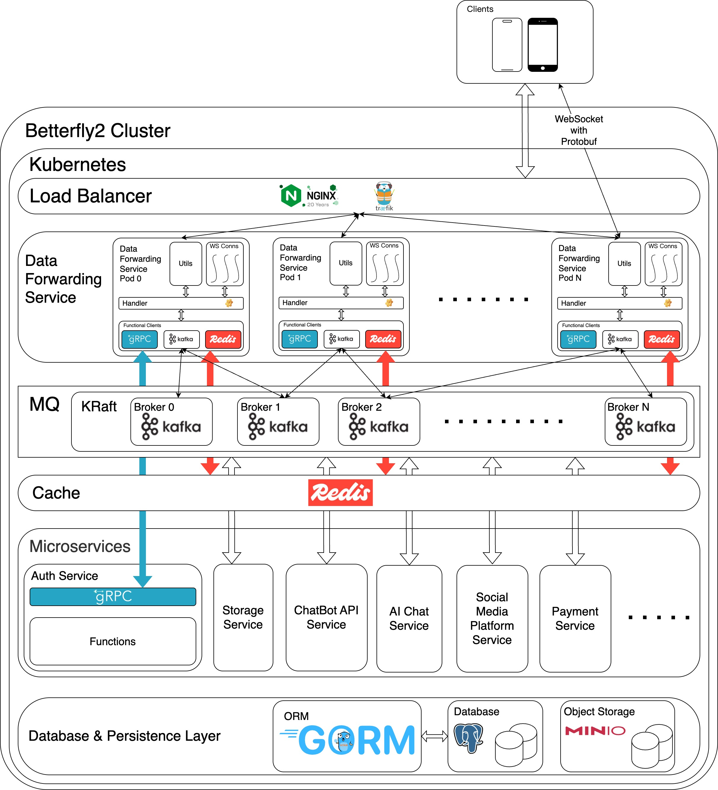

  

# Betterfly2
> 即时通信软件
>
> *本项目是[Betterfly](https://github.com/Voltline/Betterfly-Server-Python)项目的延续，使用go，基于现代后端架构设计完全重新构建*

## 成员-Collaborators
* [Voltline](https://github.com/Voltline)
* [D_S_O_](https://github.com/DissipativeStructureObject)

## 项目概况-Project Overview

- 项目启动时间：2025 年 3 月 1 日
- 开源协议：MIT License

- Project Start Date: March 1, 2025
- Open Source License: MIT License

## 架构-Architecture

### **免责声明 / Disclaimer**  
> 图中所使用的所有第三方 Logo（如 gRPC、Kafka、Redis、Nginx、GORM、PostgreSQL、MinIO、Traefik 等）均为其各自版权所有者的注册商标，仅用于技术架构说明用途。我们不拥有这些 Logo 的任何权利，也不代表与相关方有任何官方合作。如有使用不当请联系我们删除。
>
> The logos of third-party technologies used in the diagram (such as gRPC, Kafka, Redis, Nginx, GORM, PostgreSQL, MinIO, Traefik, etc.) are trademarks or registered trademarks of their respective owners. They are included solely for the purpose of illustrating the system architecture and do not imply any affiliation, endorsement, or official relationship. We do not claim ownership of these logos. Please contact us if you believe any usage is inappropriate.

## 项目信息-About Betterfly-Server-Go
### 语言-Lang
* 语言/Lang：Go 1.23.0+
### 第三方库-Third-Party Library
#### 日志-Log
* Log: [uber-zap](https://go.uber.org/zap)
#### 数据库与持久层-Database & Persistence Layer
* PostgreSQL Driver: [gorm/postgres](https://gorm.io/driver/postgres)
* Redis Client: [Redis/go-redis](https://github.com/redis/go-redis/v9)
* ORM: [gorm](https://gorm.io/gorm)
#### 消息队列-Message Queue
* Kafka Client: [Sarama](https://github.com/IBM/sarama)
#### 网络与通信-Network & Communication
* Websocket: [Gorilla/Websocket](https://github.com/gorilla/websocket)
* gRPC Libraries: [gRPC](https://google.golang.org/grpc)
#### 编码与加密-Encode & Crypto
* Protobuf Libraries: [protobuf](https://google.golang.org/protobuf)
* Crypto: [bcrypt](https://golang.org/x/crypto/bcrypt)

### 中间件-Middleware
#### 消息队列-Message Queue
* Kafka: [Apache Kafka](https://kafka.apache.org/)
#### 缓存与缓冲区-Cache & Buffer
* Redis: [Redis](https://redis.io/)

### 基础设施-Infrastructure
#### 容器化-Containerization
* Docker: [Docker](https://www.docker.com/)
* Docker Compose: [Docker Compose](https://docs.docker.com/compose/)
#### 持续集成与部署-CI/CD
* Kubernetes: [Kubernetes](https://kubernetes.io/)
* GitHub Actions: [GitHub Action](https://github.com/features/actions)
#### 数据库-Database
* PostgreSQL: [PostgreSQL](https://www.postgresql.org/)

### 开源协议-Open-Source Protocol
* [MIT](https://github.com/Voltline/Betterfly2/blob/main/LICENSE)