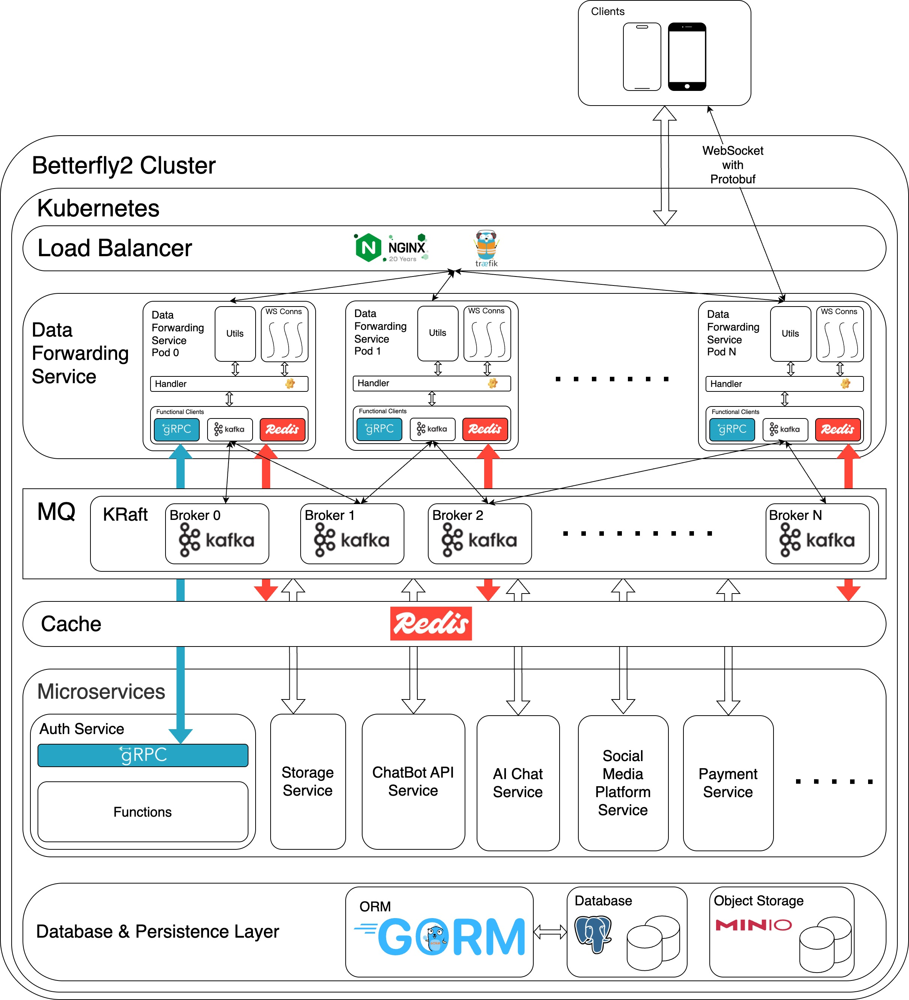

<div align="center">
  
</div>

# Betterfly2
> 现代化即时通信平台 / Modern Instant Messaging Platform
>
> *本项目是 [Betterfly](https://github.com/Voltline/Betterfly-Server-Python) 项目的延续，使用 Go 语言，基于微服务架构完全重新构建*
>
> *A continuation of [Betterfly](https://github.com/Voltline/Betterfly-Server-Python) project, completely rebuilt with Go and modern microservices architecture*


[](https://deepwiki.com/Voltline/Betterfly2)

---

## 📖 目录 / Table of Contents

- [成员 / Collaborators](#-成员-collaborators)
- [项目概况 / Project Overview](#-项目概况-project-overview)
- [核心特性 / Key Features](#-核心特性-key-features)
- [架构设计 / Architecture](#-架构设计-architecture)
- [微服务组件 / Microservices](#-微服务组件-microservices)
- [快速开始 / Quick Start](#-快速开始-quick-start)
- [技术栈 / Tech Stack](#-技术栈-tech-stack)
- [项目结构 / Project Structure](#-项目结构-project-structure)
- [API 文档 / API Documentation](#-api-文档-api-documentation)
- [开源协议 / License](#-开源协议-license)

---

## 👥 成员 / Collaborators
* [Voltline](https://github.com/Voltline)
* [D_S_O_](https://github.com/DissipativeStructureObject)

---

## 📋 项目概况 / Project Overview

| 项目信息 / Info | 详情 / Details |
|---------------|----------------|
| 项目启动时间 / Start Date | 2025 年 3 月 1 日 / March 1, 2025 |
| 开源协议 / License | MIT License |
| 语言 / Language | Go 1.23.0+ (toolchain go1.24.1+) |
| 架构 / Architecture | 微服务 / Microservices |

---

## ✨ 核心特性 / Key Features

- 🔐 **安全认证** - JWT Token 认证与 bcrypt 密码加密
- 📡 **实时通信** - 基于 WebSocket 的双向实时消息传输
- 🔄 **高可用** - 分布式会话管理，支持多实例水平扩展
- 📦 **消息队列** - Kafka 消息队列实现异步处理与解耦
- 💾 **多级缓存** - L1 (Ristretto) + L2 (Redis) 缓存策略
- 🗄️ **对象存储** - RustFS (S3 兼容) 文件存储服务
- 📊 **可观测性** - Prometheus + Grafana 监控方案
- 🐳 **容器化部署** - Docker Compose 一键部署

---

## 🏗️ 架构设计 / Architecture



### 数据转发服务分层架构 / Data Forwarding Service Layers

数据中转服务已被划分为三层，以更好地完成数据中转任务：

| 层级 / Layer | 职责 / Responsibility |
|-------------|----------------------|
| **连接层 / Connection Layer** | 管理 WebSocket 连接生命周期 |
| **会话层 / Session Layer** | 分布式会话状态管理 (Redis) |
| **路由层 / Router Layer** | 消息路由与转发决策 |

> Data-Forwarding service has been divided into three layers: Connection Layer, Session Layer and Router Layer to better accomplish the data-forwarding tasks.

### ⚠️ 免责声明 / Disclaimer
> 图中所使用的所有第三方 Logo（如 gRPC、Kafka、Redis、Nginx、GORM、PostgreSQL、RustFS、Traefik 等）均为其各自版权所有者的注册商标，仅用于技术架构说明用途。我们不拥有这些 Logo 的任何权利，也不代表与相关方有任何官方合作。如有使用不当请联系我们删除。
>
> The logos of third-party technologies used in the diagram (such as gRPC, Kafka, Redis, Nginx, GORM, PostgreSQL, RustFS, Traefik, etc.) are trademarks or registered trademarks of their respective owners. They are included solely for illustrating the system architecture and do not imply any affiliation or endorsement. Please contact us if you believe any usage is inappropriate.

---

## 🔧 微服务组件 / Microservices

| 服务 / Service | 端口 / Port | 描述 / Description |
|---------------|-------------|-------------------|
| **Data Forwarding Service** | 54342, 54343 | WebSocket 网关，负责客户端连接管理和消息路由 |
| **Auth Service** | 50051 (gRPC) | 用户认证、JWT Token 管理和授权服务 |
| **Storage Service** | 8081 (HTTP) | 消息存储、文件管理，支持多级缓存 |
| **Friend Service** | 54401 | 好友关系和联系人管理 |

### 基础设施服务 / Infrastructure Services

| 服务 / Service | 端口 / Port | 描述 / Description |
|---------------|-------------|-------------------|
| **Redis** | 6379 | 缓存与分布式会话存储 |
| **Kafka** | 9092, 9094 | 消息队列（双节点集群） |
| **Kafka UI** | 8080 | Kafka 管理控制台 |
| **RustFS** | 9000, 9001 | S3 兼容对象存储 |
| **PostgreSQL** | 5432 | 关系型数据库 |
| **Prometheus** | 9090 | 指标采集 |
| **Grafana** | 3000 | 监控仪表板 |

---

## 🚀 快速开始 / Quick Start

### 前置要求 / Prerequisites

- Go 1.23.0+ (推荐 toolchain go1.24.1+)
- Docker & Docker Compose
- Protobuf 编译器和 Go 插件

```bash
# 安装 Protobuf Go 插件
go install google.golang.org/protobuf/cmd/protoc-gen-go@latest
go install google.golang.org/grpc/cmd/protoc-gen-go-grpc@latest
```

### 启动服务 / Start Services

```bash
# 1. 克隆项目
git clone https://github.com/Voltline/Betterfly2.git
cd Betterfly2/services

# 2. 配置环境变量
export PGSQL_DSN="host=your_host user=your_user password=your_password dbname=betterfly port=5432 sslmode=disable"
export RUSTFS_ACCESS_KEY="your_access_key"
export RUSTFS_SECRET_KEY="your_secret_key"

# 3. 启动所有服务
docker-compose up -d

# 4. 查看服务状态
docker-compose ps
```

### 编译单个服务 / Build Individual Service

```bash
cd services/authService
go build -o authService .
```

### 生成 Protobuf 代码 / Generate Protobuf Code

```bash
cd proto
make
```

---

## 🛠️ 技术栈 / Tech Stack

### 语言 & 框架 / Language & Framework
| 类别 / Category | 技术 / Technology | 链接 / Link |
|----------------|------------------|-------------|
| 语言 / Language | Go 1.23.0+ | [golang.org](https://golang.org) |

### 核心库 / Core Libraries
| 类别 / Category | 技术 / Technology | 链接 / Link |
|----------------|------------------|-------------|
| 日志 / Logging | uber-zap | [go.uber.org/zap](https://go.uber.org/zap) |
| ORM | GORM | [gorm.io](https://gorm.io/gorm) |
| PostgreSQL 驱动 | gorm/postgres | [gorm.io/driver/postgres](https://gorm.io/driver/postgres) |
| Redis 客户端 | go-redis | [github.com/redis/go-redis](https://github.com/redis/go-redis) |
| Kafka 客户端 | Sarama | [github.com/IBM/sarama](https://github.com/IBM/sarama) |
| WebSocket | Gorilla WebSocket | [github.com/gorilla/websocket](https://github.com/gorilla/websocket) |
| gRPC | grpc-go | [google.golang.org/grpc](https://google.golang.org/grpc) |
| Protobuf | protobuf | [google.golang.org/protobuf](https://google.golang.org/protobuf) |
| 加密 / Crypto | bcrypt | [golang.org/x/crypto/bcrypt](https://golang.org/x/crypto/bcrypt) |
| 内存缓存 / In-Memory Cache | Ristretto | [github.com/dgraph-io/ristretto](https://github.com/dgraph-io/ristretto) |

### 中间件 & 基础设施 / Middleware & Infrastructure
| 类别 / Category | 技术 / Technology | 链接 / Link |
|----------------|------------------|-------------|
| 消息队列 / MQ | Apache Kafka | [kafka.apache.org](https://kafka.apache.org/) |
| 缓存 / Cache | Redis | [redis.io](https://redis.io/) |
| 数据库 / Database | PostgreSQL | [postgresql.org](https://www.postgresql.org/) |
| 对象存储 / Object Storage | RustFS | [rustfs.com](https://rustfs.com/) |
| 容器化 / Containerization | Docker & Docker Compose | [docker.com](https://www.docker.com/) |
| 监控 / Monitoring | Prometheus & Grafana | [prometheus.io](https://prometheus.io/) |

---

## 📁 项目结构 / Project Structure

```
Betterfly2/
├── common/                    # 公共配置与脚本
│   ├── kafka/                 # Kafka Docker 配置
│   ├── pgsql/                 # PostgreSQL 工具脚本
│   ├── redis/                 # Redis Docker 配置
│   └── ws_ssl/                # WebSocket SSL 证书生成
├── proto/                     # Protocol Buffer 定义
│   ├── data_forwarding/       # 客户端-服务器通信协议
│   ├── envelope/              # 消息信封定义
│   ├── server_rpc/            # 服务间 gRPC 定义
│   └── storage/               # 存储服务协议
├── services/                  # 微服务实现
│   ├── authService/           # 认证服务
│   ├── dataForwardingService/ # 数据转发服务
│   ├── friendService/         # 好友服务
│   ├── storageService/        # 存储服务
│   └── monitoring/            # 监控配置 (Prometheus/Grafana)
├── shared/                    # 共享组件
│   ├── db/                    # 数据库连接与模型
│   ├── logger/                # 日志工具
│   ├── metrics/               # 指标采集
│   └── utils/                 # 通用工具函数
└── tool/                      # 开发工具
    └── bin/                   # protoc 编译器 (Linux/macOS)
```

---

## 📚 API 文档 / API Documentation

详细的 API 文档请参阅：
- [API_DOCUMENTATION.md](API_DOCUMENTATION.md) - 存储服务 HTTP API 文档
- [INTERFACE_DEVELOPMENT.md](INTERFACE_DEVELOPMENT.md) - 服务端接口新增与模块自注册指南
- [RustFS 配置说明](services/RUSTFS_SETUP.md) - 对象存储配置指南

---

## 📄 开源协议 / License

本项目采用 [MIT License](LICENSE) 开源协议。

```
MIT License

Copyright (c) 2025 Voltline

Permission is hereby granted, free of charge, to any person obtaining a copy
of this software and associated documentation files (the "Software"), to deal
in the Software without restriction, including without limitation the rights
to use, copy, modify, merge, publish, distribute, sublicense, and/or sell
copies of the Software...
```

---

<div align="center">
  <p>Made by <a href="https://github.com/Voltline">Voltline</a> & <a href="https://github.com/DissipativeStructureObject">D_S_O_</a></p>
</div>
