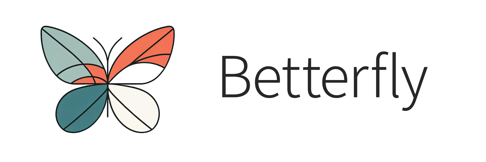
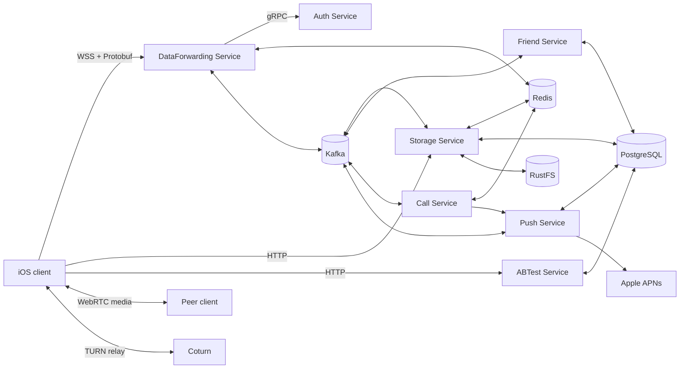

<div align="center">
  
</div>

# Betterfly2

Betterfly2 是 [Betterfly](https://github.com/Voltline/Betterfly) 的 Go 微服务重构版本，提供即时消息、好友与群组、消息同步、文件传输、客户端实验、WebRTC 通话和 iOS APNs 推送能力。


## 当前能力

- WebSocket + Protobuf 客户端长连接，Redis 保存跨 DataForwarding Pod 的路由状态。
- Kafka 解耦消息存储、好友与群组、通话信令及推送任务。
- PostgreSQL 持久化用户、关系、消息、文件元数据、实验和推送设备。
- Ristretto L1 + Redis L2 + PostgreSQL 的消息与资料查询缓存。
- RustFS 预签名直传、服务端 SHA-512 校验和鉴权下载。
- 一对一 WebRTC 语音/视频通话，支持 Coturn 中继与 PushKit 离线唤醒。
- APNs sandbox/production 双环境、普通消息通知和受保护的内网调试后台。
- 基于设备或其他主体稳定分流的 AB 实验，以及实验推全、撤回和例外分组。
- Docker Compose Profiles 可裁剪部署，以及面向单集群验证的 Kubernetes 清单。

## 架构与数据流


```mermaid
flowchart LR
    Client["iOS client"] -->|"WSS + Protobuf"| DF["DataForwarding Service"]
    Client -->|"HTTP"| Storage["Storage Service"]
    Client -->|"HTTP"| AB["ABTest Service"]
    DF -->|"gRPC"| Auth["Auth Service"]
    DF <--> Redis[(Redis)]
    DF <--> Kafka[(Kafka)]
    Kafka <--> Storage
    Kafka <--> Friend["Friend Service"]
    Kafka <--> Call["Call Service"]
    Kafka <--> Push["Push Service"]
    Storage <--> Redis
    Storage <--> PG[(PostgreSQL)]
    Storage <--> RustFS[(RustFS)]
    Friend <--> PG
    AB <--> PG
    Push <--> PG
    Push --> APNs["Apple APNs"]
    Call <--> Redis
    Call --> Push
    Client <-->|"WebRTC media"| Peer["Peer client"]
    Client <-->|"TURN relay"| Coturn["Coturn"]
```

客户端业务请求首先进入 DataForwarding Service。认证走 Auth gRPC；异步业务封装为 Protobuf Envelope 后进入固定 Kafka topic，由任一对应 Service Pod 消费，再根据请求中的 DataForwarding Pod topic 返回响应。客户端之间的实时消息最终仍由目标用户在 Redis 中登记的 Pod 路由送达。

文件上传和下载是例外：Storage Service 只签发 URL、维护元数据并校验哈希，文件内容由客户端直接与 RustFS 传输。WebRTC 媒体也不经过 Call Service，Call Service 只维护信令和通话状态。

## 服务清单

| 服务 | 客户端或内部入口 | 作用 |
| --- | --- | --- |
| DataForwarding Service | `wss://host:54342/ws` | WebSocket 会话、协议分发和跨 Pod 路由；`redundancy` profile 增加 `54343` 实例 |
| Auth Service | 内网 gRPC `50051` | 注册、登录、JWT 校验和登出失效 |
| Storage Service | Kafka `storage-service`；HTTP `8081` | 消息与资料持久化、同步查询、文件控制面 |
| Friend Service | Kafka `friend-service`；HTTP `54401` | 好友关系、群组和群成员维护；HTTP 仅提供内网探针 |
| ABTest Service | HTTP `8082` | 实验配置获取、服务端求值和管理后台 |
| Call Service | Kafka `call-service`；HTTP `8085` | 一对一通话信令与状态；HTTP 仅提供探针 |
| Push Service | Kafka `push-service`；HTTP `8086` | PushKit/普通 APNs 推送；HTTP 提供探针和受保护后台 |

主要基础设施端口：Redis `6379`、Kafka `9092/9094`、RustFS S3 `9000`、RustFS Console `9001`、Coturn `3478/tcp+udp` 与 `49160-49200/udp`。Kafka UI `8080`、Prometheus `9090` 和 Grafana `3000` 只在相应可选 profile 中启动。PostgreSQL 当前由 `PGSQL_DSN` 指向外部实例，Compose 不负责创建数据库。

## 快速开始

### 前置条件

- Go 1.24 toolchain。个别基础模块声明了更低版本，但当前服务模块统一使用 Go 1.24。
- Docker 与 Docker Compose v2。
- 可用的 PostgreSQL 数据库。
- 仅在修改 Protobuf 时需要 `protoc`、`protoc-gen-go` 和 `protoc-gen-go-grpc`。

### 启动标准环境

```bash
git clone https://github.com/Voltline/Betterfly2.git
cd Betterfly2/services

export PGSQL_DSN="host=your_host user=your_user password=your_password dbname=betterfly port=5432 sslmode=disable"
export RUSTFS_ACCESS_KEY="your_access_key"
export RUSTFS_SECRET_KEY="your_secret_key"

./deploy_docker_compose.sh standard --cert
docker compose ps
```

`standard` 启动当前全部业务能力，但不启动 Prometheus、Grafana、Kafka UI 和第二个 DataForwarding 实例。首次部署或证书地址发生变化时使用 `--cert`；修改协议后追加 `--proto`。

低资源环境可以使用 `minimal`，但它只包含认证、连接以及好友/群组控制面，不包含 Storage Service，因此不是完整的消息发送环境。完整 profile 语义见[可裁剪部署](services/DEPLOYMENT_PROFILES.md)。

### 增量重建

```bash
cd services
./rebuild_docker_compose.sh df
./rebuild_docker_compose.sh --proto storage friend
./rebuild_docker_compose.sh --list
```

`build_docker_compose.sh` 保留历史上的全量部署范围，但会复用已有证书、Go 模块缓存和未变化的容器。只有证书地址变化时才追加 `--cert`，确实需要重建未变化容器时才追加 `--force-recreate`。日常开发优先使用 `rebuild_docker_compose.sh`，避免每次检查全部镜像。

应用镜像使用 BuildKit 共享 Go 模块与编译缓存。首次构建仍需下载和编译依赖；不要在日常开发中执行 `docker builder prune`，否则下一次会重新承担这部分冷启动成本。

### 生成协议与运行测试

```bash
make -C proto

cd services/dataForwardingService
go test ./...
```

仓库由多个 Go module 组成，没有可在根目录覆盖所有服务的单一 `go test ./...`。请在改动涉及的服务、`shared` 或具体 `proto` module 内分别运行测试；跨服务回归入口见[回归测试文档](REGRESSION_TESTING.md)。

## 项目结构

```text
Betterfly2/
├── common/                    # Kafka/Redis 辅助配置与 WebSocket 证书脚本
├── deploy/k8s/                # 单集群验证用 Kubernetes manifests
├── proto/                     # DataForwarding、Storage、Friend、Call、Push 协议
├── services/                  # 七个业务服务、Compose 与部署脚本
├── shared/                    # 数据库、日志、指标、MQ 和通用分发器
├── tool/                      # Protobuf 编译工具
├── API_DOCUMENTATION.md       # 当前 HTTP、Kafka 与 Protobuf 接口说明
├── INTERFACE_DEVELOPMENT.md   # 新增接口与模块自注册指南
└── REGRESSION_TESTING.md      # 跨服务回归测试说明
```

## 文档导航

| 文档 | 内容 |
| --- | --- |
| [API 文档](API_DOCUMENTATION.md) | Storage、ABTest、Call、Push 的对外与内部协议 |
| [接口新增指南](INTERFACE_DEVELOPMENT.md) | DataForwarding、Storage、Friend 模块自注册流程 |
| [回归测试](REGRESSION_TESTING.md) | Docker Compose 跨 Pod 端到端测试 |
| [可裁剪部署](services/DEPLOYMENT_PROFILES.md) | `minimal`、`standard`、`full` 与 profile 组合 |
| [RustFS 配置](services/RUSTFS_SETUP.md) | 对象存储、外部预签名地址与故障排查 |
| [Call Service](services/callService/README.md) | WebRTC、Coturn 和 PushKit 唤醒 |
| [Push Service](services/pushService/README.md) | APNs 双环境、普通通知与内网调试后台 |
| [Monitor 账号](services/dataForwardingService/MONITOR.md) | 仅用户 ID 1 可见的服务状态与管理指令 |
| [Kubernetes](deploy/k8s/README.md) | 当前单集群验证清单的范围与限制 |
| [数据库与可靠性运维](deploy/DATABASE_AND_RELIABILITY.md) | 独立迁移、连接池预算、Kafka 重试与 DLQ 语义 |
| [协议生成](proto/docs/README.md) | Protobuf 依赖、生成命令和目录说明 |

## 项目成员

- [Voltline](https://github.com/Voltline)
- [D_S_O_](https://github.com/DissipativeStructureObject)

## License

Betterfly2 使用 [MIT License](LICENSE)。
