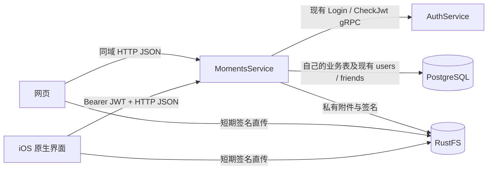

# MomentsService 设计稿

状态：待确认的设计，不表示以下 API、迁移或服务已经实现。

## 1. 定位与范围

MomentsService 是独立的好友动态服务，目录 `services/momentsService`，Compose
服务名 `moments_service`，建议 HTTP 端口 `8087`。它提供用户网页和版本化 JSON API，
网页与未来的原生界面都是同一 API 的消费者，不存在网页专用业务路径。

首期支持纯文字、文字加图片、纯图片动态，最多九张图片；支持个人动态、好友时间流、
点赞、取消点赞、评论、一层展示的评论回复，以及删除。暂不支持视频、编辑已发布动态、
公开推荐流、转发、广告、实时广播及 APNs 动态通知。

“全部点赞和评论可见”指所有有权查看该动态的人均可查看完整的互动内容，
不限制共同好友，并不意味着匿名用户或非好友可以读取好友可见动态。

## 2. 服务与部署边界



- 复用 Go、`net/http`、GORM、shared 数据库/日志/指标和现有 Auth gRPC。
- 静态资源独立放在服务的 `web/` 下，由服务托管；页面不直接访问数据库。
- 用户网页 `/moments/`，API `/moments/api/v1/`；生产入口使用同域 HTTPS。
- 普通业务事务直接写 PostgreSQL，不经过 DataForwarding 或聊天 Post，不新建 Kafka topic。
- 首期不增加 Redis 信息流缓存、内容扇出、后台任务框架或新的管理后台。
- 增加可选 `moments` Compose profile，标准及全量构建入口在实现时一并接入。
- 数据库连接预算建议每副本 6 个最大连接、2 个空闲连接，复用现有连接池参数。
- 新增显式迁移 v10，当前代码迁移列表为 v1-v9；不得修改既有迁移。
- 先运行新版 migration runner，再启动 Moments；业务进程不执行 DDL。
- 旧客户端不需要改 Protobuf；使用原生动态功能的客户端新增 HTTP 接口适配即可。

## 3. 页面与交互

### 导航与信息密度

顶部将品牌、好友/个人时间流导航及发布入口整合为一条导航；选中状态使用细下划线，
不采用三栏后台布局。移动端自然换行，保留触控空间，不缩小按钮来硬塞导航。
桌面以适中宽度的单列时间流为主，普通字体、暖中性色背景和克制的橙色操作强调；
头像、正文、照片、互动内容形成明确层次，点赞及评论直接排列，不套重复彩色卡片。
信息流顶部提供轻量发布入口；个人动态显示个人信息，不增加装饰性统计仪表盘。
不放大型欢迎区。图片采用一至三列网格，点击进入图片查看，返回原来的信息流或详情。

设计参考：[Threads 网页单列导航](https://about.fb.com/news/2025/04/new-features-threads-web-experience/)
与 [Facebook 信息流和照片布局](https://about.fb.com/news/2025/12/making-it-easier-to-create-discover-and-share-content-on-facebook/)。
借鉴内容优先、轻导航和照片网格，不引入推荐算法、多栏工作台或这些产品的其他业务功能。

### 好友动态

每条包含头像、昵称、发布时间、可见性、原文、图片、有序点赞名单预览与评论预览。
默认每页 20 条，支持加载更多和主动刷新；首期不后台轮询。
点赞操作立即呈现本地操作反馈，但实际实现必须以 API 返回为准，失败恢复原状态。
评论预览最多两条；详情页可以分页获取全部评论和点赞名单。

### 发布动态

正文输入、Unicode 字数提示、图片预览及移除、可见性选择、发布按钮。
图片先上传并完成服务端校验，再发布动态；任一附件未 verified 时不能发布。
明确显示上传失败、校验失败、会话失效和发布失败，不把部分失败误报为成功。
网络不确定时保留原 `client_post_id` 重试，页面在拿到确定的响应前不清空草稿。

### 个人动态与详情

自己的主页显示好友可见和仅自己可见动态；他人主页只展示查看者有权读取的记录。
详情展示全文、图片和所有可见互动，支持回复和评论分页。
作者删除动态；评论作者或动态作者可以删除评论。删除必须有明确确认。
空列表、请求失败、内容不可访问和过期登录分别显示，不把网络失败呈现为“暂无动态”。

## 4. 认证与权限

### 同一账号，两种入口

- 原生：`Authorization: Bearer <JWT>` 和 `X-User-ID`；后者只是身份提示，
  必须由 Auth.CheckJwt 校验其与 JWT 的绑定，并使用校验结果中的用户 ID。
- 独立网页：通过本服务登录接口调用现有 Auth.Login，设置同域 HttpOnly、Secure、
  SameSite Cookie；服务端按现有 JWT 校验规则验证每次 API 请求。
- 嵌入网页：客户端对受控同域 session 接口发送现有 JWT，建立网页 Cookie；
  不把 JWT 放入 URL、页面源码、日志或 localStorage，不新增一次性交换码基础设施。
- Cookie 修改请求增加 CSRF token 与精确 Origin 校验；Bearer 请求不借用浏览器 Cookie
  作为另一账号的隐式回退。两类凭据冲突时明确拒绝。
- 网页退出只清除网页凭据，不轮换 JwtKey，也不退出原生客户端。
- Auth 不可用返回 503，而不是把暂时故障当作 JWT 失效并清除登录状态。
- 网页登录失败不建立 Cookie；新增 HTTP 密码入口需限流及通用错误反馈，不能成为无限密码试探入口。

### 可见性

| visibility | 允许读取 |
| --- | --- |
| friends | 作者本人或当前双向有效好友 |
| private | 仅作者本人 |

首期没有 public。新好友可读取此前发布的 friends 动态；删除好友后后续请求不可再读。
仅自己可见内容不会进入其他人的列表，也不允许其他人点赞、评论或下载附件。
作者身份只从认证上下文获得，发布正文不能指定作者。

动态列表、个人主页、单条详情、评论、点赞名单和附件下载共用同一可见性判定。
未授权和不存在统一返回 404；数据库或认证服务异常不得伪装成空列表或不存在。

所有能看动态的人可以看到所有点赞和评论，包括并非自己好友的互动者。
动态作者删除与互动者的好友关系后，历史互动不自动消失，但对方不能继续读取或新增互动。
评论作者仍可删除自己已发表的评论，即使后来失去动态读取权限；该操作不返回动态正文。

## 5. 数据模型

新表使用 bigint ID、`timestamptz` 时间列，JSON ID 使用字符串；时间传输 RFC3339 UTC，
网页显示 UTC+8。时间和 ID 都由服务端生成，客户端时间不参与排序。

| 表 | 核心字段和约束 |
| --- | --- |
| moment_posts | id、author_user_id、client_post_id、request_fingerprint、content、visibility、created_at、deleted_at；UNIQUE(author_user_id, client_post_id) |
| moment_assets | id、owner_user_id、client_asset_id、post_id（草稿时为空）、position、hash、size、MIME、width、height、staging_key、storage_key、status、created_at；UNIQUE(owner_user_id, client_asset_id)，绑定顺序不可重复 |
| moment_comments | id、post_id、author_user_id、client_comment_id、request_fingerprint、reply_to_comment_id、content、created_at、deleted_at；UNIQUE(author_user_id, client_comment_id) |
| moment_likes | post_id、user_id、created_at；PRIMARY KEY(post_id, user_id) |

帖子和评论正文保留换行，作为纯文本输出与展示，不接收任意 HTML。
帖子最多 4096 Unicode code points / 16 KiB UTF-8；评论最多 1000 code points / 4 KiB。
拒绝无效 UTF-8 和超限内容，不截断；纯空白正文且没有图片时拒绝。

动态及评论列表分别建立作者/帖子 + created_at + id 索引。
列表批量获取作者基本信息、附件、互动数量和查看者是否点赞，不能逐条查询产生 N+1。
首期通过聚合查询计算数量，不维护易漂移的独立计数器。

删除动态保留 ID、幂等键和删除标记，清空正文；附件仍保留绑定，不能重新变为可读草稿。
点赞和评论从查询中失效，评论正文同步清除。被回复的已删除评论保留最小标记，
已有回复仍可显示“原评论已删除”，不得返回被删正文。

## 6. HTTP 契约

以下路径相对 `/moments/api/v1`。操作身份始终来自认证上下文。

| Method | 路径 | 主要参数或语义 |
| --- | --- | --- |
| POST | /session | 账号密码登录，或用现有 Bearer JWT 接入；两种模式互斥 |
| DELETE | /session | 清除网页 Cookie，不执行全账号撤销 |
| GET | /me | 返回当前用户的公开资料和网页会话状态 |
| GET | /feed | cursor、limit；自己和好友的可见动态 |
| GET | /users/{id}/posts | cursor、limit；始终按查看者权限过滤 |
| POST | /posts | client_post_id、content、visibility、按显示顺序排列的 asset_ids |
| GET | /posts/{id} | 完整动态及少量互动预览 |
| DELETE | /posts/{id} | 仅作者；幂等删除，不物理删除幂等键 |
| GET | /posts/{id}/likes | cursor、limit；完整点赞名单 |
| PUT / DELETE | /posts/{id}/like | 添加/取消自己的点赞；重复调用不重复计数 |
| GET | /posts/{id}/comments | cursor、limit；平铺列表，不递归加载回复树 |
| POST | /posts/{id}/comments | client_comment_id、content、可选 reply_to_comment_id |
| DELETE | /comments/{id} | 评论作者或动态作者；只返回删除结果 |
| POST | /assets | client_asset_id、SHA-512、size、MIME；申请私有直传 |
| POST | /assets/{id}/verify | 仅上传者，校验并封存上传对象 |
| GET | /assets/{id}/download | 校验附件所属动态可见性；未绑定草稿仅上传者可读 |

帖子列表按 `(created_at DESC, id DESC)` 游标分页；评论及点赞名单按
`(created_at ASC, id ASC)` 分页。默认 limit=20、上限 50；游标必须验证格式、边界和
查询上下文，SQL 使用绑定参数。每页重新鉴权，游标不能成为绕过权限的凭据。

响应结构示例：

```json
{
  "items": [{
    "id": "1201",
    "author": {"id": "1", "name": "Voltline", "avatar": "<现有头像标识>"},
    "content": "今天的记录\n保留原始换行。",
    "visibility": "friends",
    "created_at": "2026-10-03T08:00:00Z",
    "assets": [{"id": "8301", "width": 1600, "height": 1200}],
    "like_count": 2,
    "comment_count": 1,
    "liked_by_me": false,
    "can_delete": true
  }],
  "next_cursor": "<opaque-cursor>",
  "has_more": true
}
```

正文不返回 S3 storage_key 或可用于旧通用下载入口的文件 hash；附件通过 ID 获取。
响应的 can_delete 等字段用于界面呈现，不替代服务端再次鉴权。
错误统一为 `{"error":{"code":"...","message":"..."}}`，区分 400 参数、401 登录、
404 不可访问、409 幂等冲突、410 自己的已删除重试、413 体积和 503 暂时不可用。
对非作者不使用 410 暴露动态曾经存在。

## 7. 图片私密性与完整性

现有 Storage 下载只检查 JWT、元数据、verified 和对象存在性，不检查好友或动态权限。
因此不能仅在动态 API 加鉴权，再把私有附件放进既有可按 hash 下载的文件命名空间。

复用 RustFS 实例，但使用独立私有 bucket `betterfly-moments`，不允许匿名读取，
动态附件不写入旧 `file_metadata` 的通用可下载记录。服务使用 S3 能力及同一 SHA-512
校验方式；不直接导入另一个服务的 `internal` 包。

建议流程：

1. 申请附件：记录 owner 和 pending，签发最多 10 分钟的 staging 上传 URL。
2. 客户端直传，完成后调用 verify。服务限制读取总字节数，校验 SHA-512、真实格式、
   文件体积及图片尺寸；首期接受 JPEG/PNG，单张最多 10 MiB，客户端转换 HEIC。
3. 将已校验的同一份字节封存到仅服务端能写入的最终对象位置，再标记 verified。
   不能验证后继续使用仍可被未过期 PUT URL 替换的 staging 对象。
4. 发布事务只绑定本人拥有、已 verified 且尚未绑定其他动态的附件。
5. 下载先检查当前权限，再签发约 60 秒 URL；响应禁止共享缓存。

相同 client_asset_id 只产生一个附件；同键不同 hash/size 返回 409。
对象封存成功但元数据写入失败时允许安全重试 verify，不误报成功或删除已校验内容。
已签发 URL 在到期前仍可能访问，已下载图片不可收回；不承诺即时撤销已发出的 URL。
首期不建设新的垃圾回收任务，未发布或已删除对象可能占用空间，需要后续集中维护；
必须提供容量与附件状态的可观测性，而不是在发布请求中全表清理。

## 8. 事务、重试与删除

- 发布在一个事务中检查附件归属、写动态并绑定附件；成功提交后才能返回发布成功。
- 同 author + client_post_id、相同正文/可见性/附件顺序：返回同一个 ID 和 created_at。
- 同幂等键不同请求：409，不覆盖原记录；事务失败不留下已完成幂等结果。
- 已删除的幂等键不能再次发布：作者重试得到 410，必须用新 ID 发布新动态。
- 评论采用同样的 client_comment_id 规则；回复对象必须属于同一可见动态。
- 点赞使用唯一约束及 PUT/DELETE，不使用非原子的先查询后递增。
- 写操作在事务内检查目标状态，动态删除与新增点赞/评论按同一帖子记录串行判定，
  防止已删除动态继续被写入互动。
- 首期没有 Kafka/APNs 副作用，数据库提交是业务完成边界；不声称网络响应 exactly-once。

## 9. 验收与实施顺序

1. 冻结 JSON 请求、响应、错误码、分页和权限测试；先给原生客户端提供接口契约。
2. 添加显式迁移、MomentsService API 和私有图片链路，不修改聊天协议或消息表。
3. 实现同 API 网页，加入 Compose/Dockerfile、就绪探针及现有 metrics 能力。
4. 完成真实数据库、RustFS 和账号验收，再提供原生客户端适配说明。

最低验收集合：

- 非好友、仅自己可见、删除好友、ID 猜测及附件越权；点赞评论无共同好友过滤。
- 网页及原生认证一致；JWT 撤销、Auth 暂时故障、CSRF 和登录失败。
- Unicode/换行/空正文、九图及十图、错误 hash、图片伪装、体积和未校验附件。
- 并发重复发布与评论只生成一条；不同正文同键冲突；提交成功响应丢失后重试。
- 并发点赞不重复；删帖与互动并发；已删除幂等键不能复活。
- 相同时间戳稳定分页、翻页时新增动态、跨用户游标及批量查询无 N+1。
- 网页桌面与移动布局、草稿保留、失败回滚和明确空状态。
- 分模块 go test / race / vet、迁移重跑、Compose 验证及跨客户端流程。

本设计不引入公共内容审核能力，因此第一版只面向可信账号的好友圈；面向陌生用户开放
前必须另行确定举报、审核、配额及滥用治理，不能把好友圈直接作为公开广场上线。
